# README

Udacity Full Stack Web Developer Nanodegree Program

Project 4: Catalog App

Author: Aleksandr Zonis

## Description

TLTR - Python CRUD web app with Flask framework, SQLite Database, SQLAlchemy toolkit, Google Sign-in and JSON endpoints.

- The name of application is "Furniture Catalog App"
- This is a a RESTful web application using the Python and the Python framework Flask
- It uses SQLite Database to store User, Category and Product information
- The App is implementing Google Sign-In OAuth authentication using flow from [oauth2client.client](https://oauth2client.readthedocs.io/en/latest/source/oauth2client.client.html) library
- Create, delete and update operations do consider authorization status prior to execution
- The app implements a JSON endpoints that serves the same information as displayed in the HTML endpoints for an arbitrary item or category in the catalog, or the all info from the catalog
- The most important part of the application code is located in the [project.py](project.py) file.
It has Flask routing for all the web pages of the app.
- The App is formatted and compliant with the Python [PEP 8](https://www.python.org/dev/peps/pep-0008/) style guide.
- The app is fully responsive. The web pages of the App use [Bootstrap 4](https://getbootstrap.com/docs/4.0/getting-started/introduction/), which is HTML, CSS, and JavaScript framework for developing responsive, mobile-first websites.


## Installing and Starting Using the Furniture Catalog App

### Install and Configure Virtual Machine

You will use a virtual machine (VM) to run the app. The VM is a Linux server system that runs on top of your own computer. You can share files easily between your computer and the VM.

I was using the Vagrant software to configure and manage the VM. Here are the tools you'll need to install to get it running: 

#### VirtualBox
VirtualBox is the software that actually runs the VM. You can download it from virtualbox.org, [here](https://www.virtualbox.org/wiki/Downloads). Install the platform package for your operating system.  You do not need the extension pack or the SDK.

#### Vagrant
Vagrant is the software that configures the VM and lets you share files between your host computer and the VM's filesystem.  You can download it from vagrantup.com, [here](https://www.vagrantup.com/downloads.html). Install the version for your operating system.

#### Use Git to clone the VM configuration

```shell
git clone https://github.com/AlikZi/fullstack-nanodegree-vm.git fullstack
```

#### Run the Virtual Machine

Using the terminal, change directory to fullstack/vagrant 

```shell
cd fullstack/vagrant
```

Then type 

```shell
vagrant up
```
to launch your virtual machine. 

Once it is up and running, type 

```shell
vagrant ssh
``` 
to log into it. This will log your terminal in to the virtual machine, and you'll get a Linux shell prompt.

#### Install necessary modules

If you want to run Application using python 2, most of the modules are already pre-installed. But, if you are planning to run it in python 3. To make you

For Python 2, run:

`pip install -r requirements.txt`

For Python 3, run:

`pip3 install -r requirements3.txt`


### Cloning Application to the VM

Clone [Furniture Catalog App](https://github.com/AlikZi/udacity-fullstack-catalog-project4.git) to fullstack/vagrant directory. 
- Keep Terminal window where VM is running open 
- Open new Terminal window
- Get to fullstack/vagrant directory
- Clone Application to that directory

```shell
git clone https://github.com/AlikZi/udacity-fullstack-catalog-project4.git catalogApp
```

### Creating OAuth Gooogle Credentials

To run this app you will also need to create OAuth Client ID credentials

- Go to [console.cloud.google.com/apis/](https://console.cloud.google.com/apis/)
- Sign In
- Create a new project and give it whatever name you like
- Go to [credentials section](https://console.cloud.google.com/apis/credentials)
- Once on Credentials section, click 'create credential' button and follow steps:
	- Click OAuth Cliend ID
	- Choose 'Web Application'
	- Name it
	- IMPORTANT: Insert 'http://localhost:8000' to the Authorised Origins and Redirects
- Once credential is created, click on it. Find 'DOWNLOAD JSON'. Download JSON file, save it as 'client_secrets.json' in /catalogApp directory

### Running Application on the VM

Once you complete steps from above: Install and Configure Virtual Machine, Cloning Application to the VM and Creating OAuth Gooogle Credentials, you can run the application.

- On the terminal window where Virtual Machine is running go to the application directory /catalogApp

- Create database

`python database_setup.py` or `python3 database_setup.py`

- Populate database

`python addproducts.py` or `python3 addproducts.py`

- And finally, run the app

`python project.py` or `python3 project.py`

Once it is running. Visit [http://localhost:8000](http://localhost:8000) in the browser.

## Using Furniture Catalog App

The home page displays navbar with Application name, Home Button and Log In button; categories link list and recently added products.

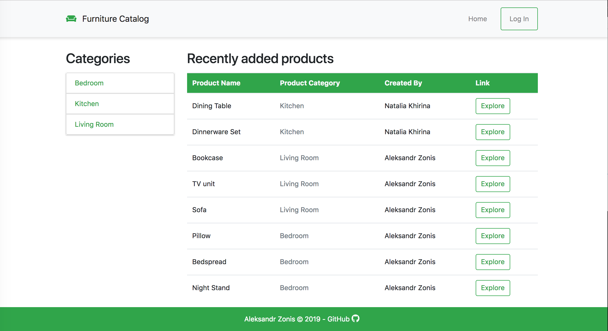

You can view all the categories and products in the catalog, but if you want to create your own category or product you need to log in via Google Sign In.

- Login Page.

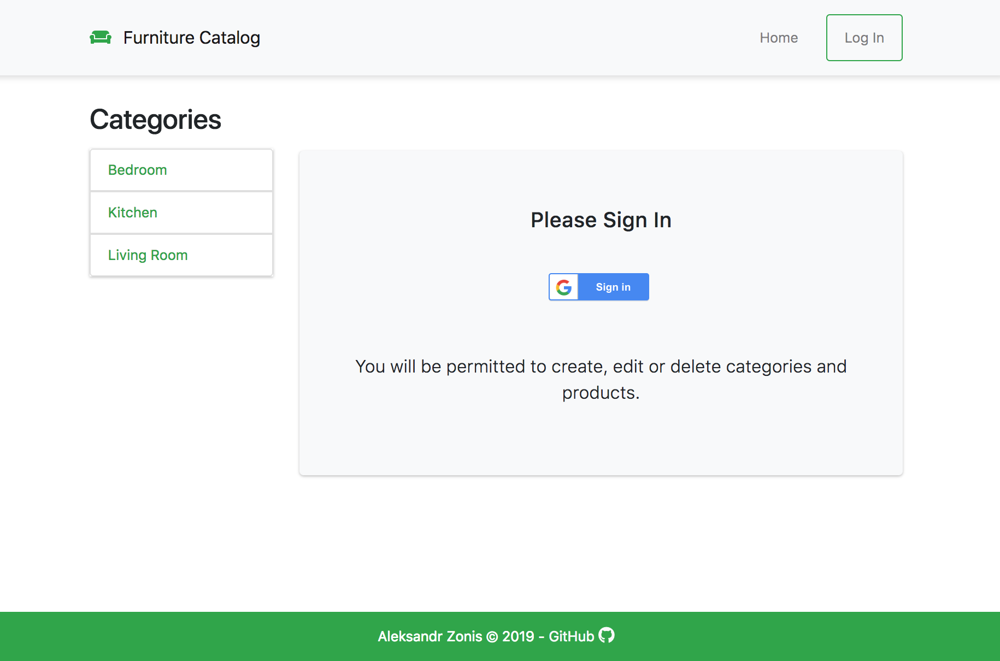

-Google Sign in page.

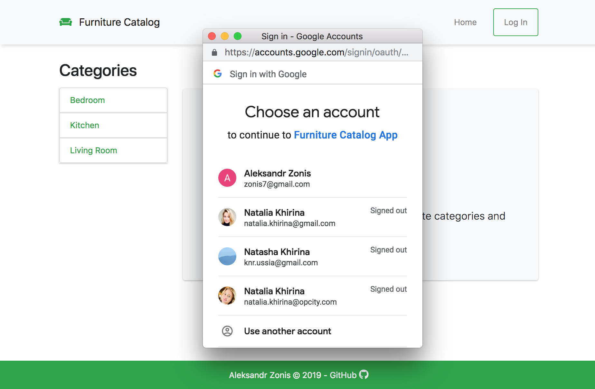

Once you are logged in, you are able to Create category or product. In the navbar you can spot 'add category' and 'add product' links.


If you are logged in, you can also Update or Delete category or product, but only if you are the creator of the product or the category.

- View category and have options to edit or delete category, if you created it.

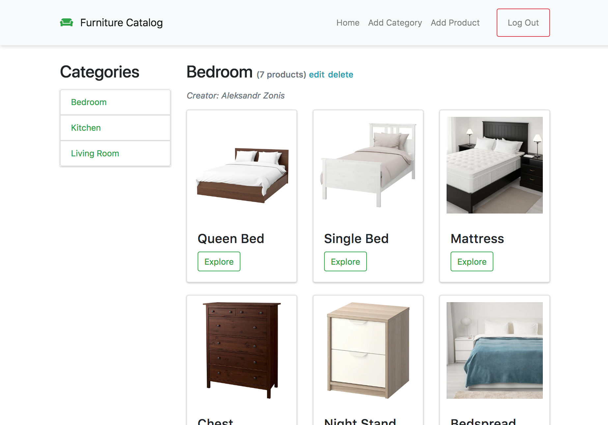

- Edit category.

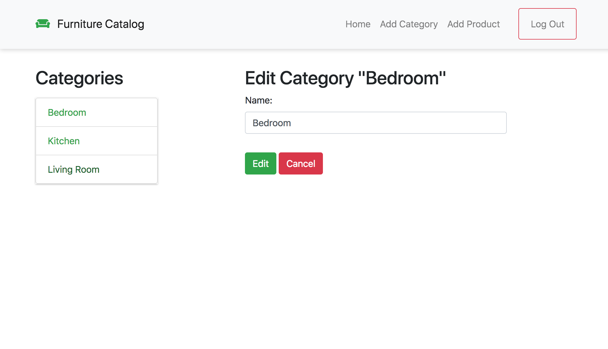

- View product and have options to edit or delete product, if you created it.


- Edit product.

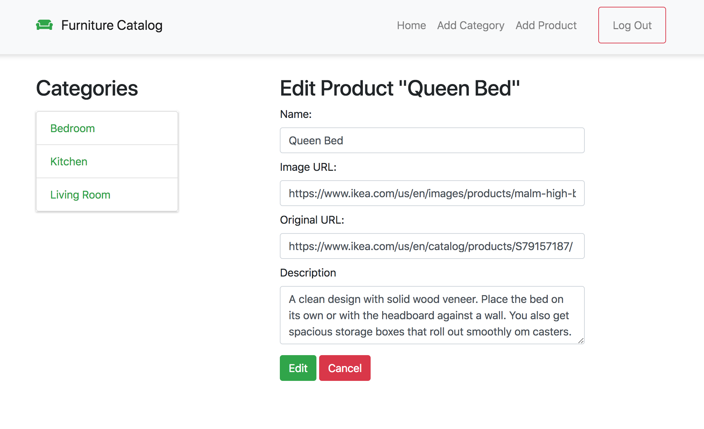

-Delete product.

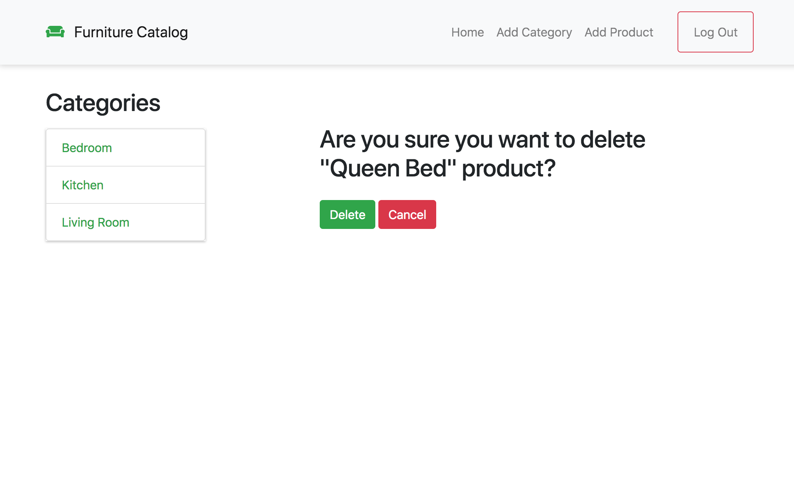

The application is fully responsive and can be used via mobile or desktop display.

- Responsive Category Page

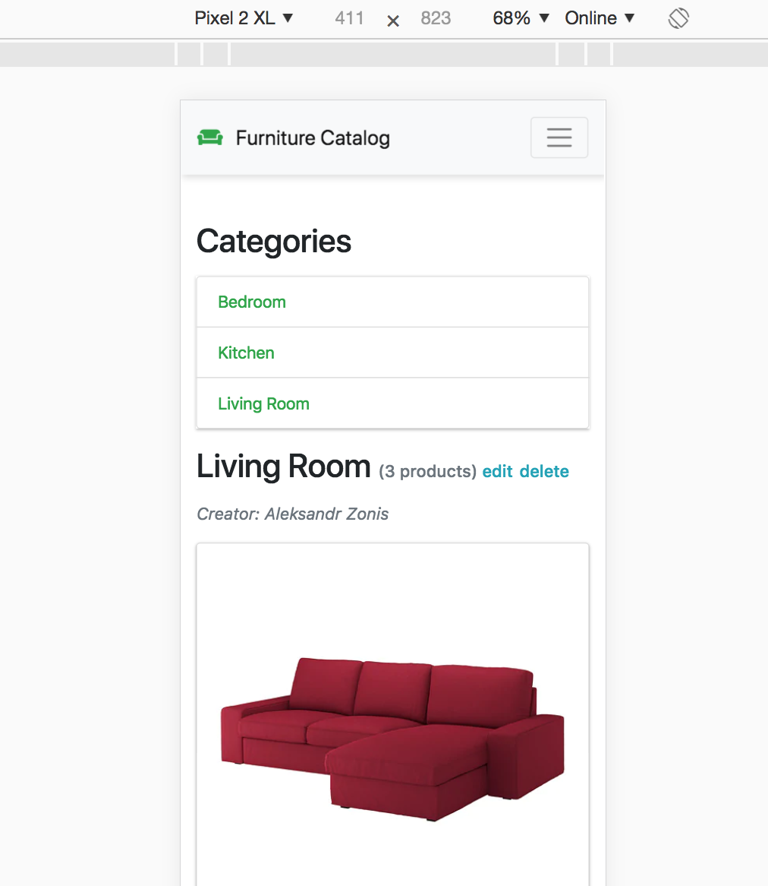

- Responsive Home Page

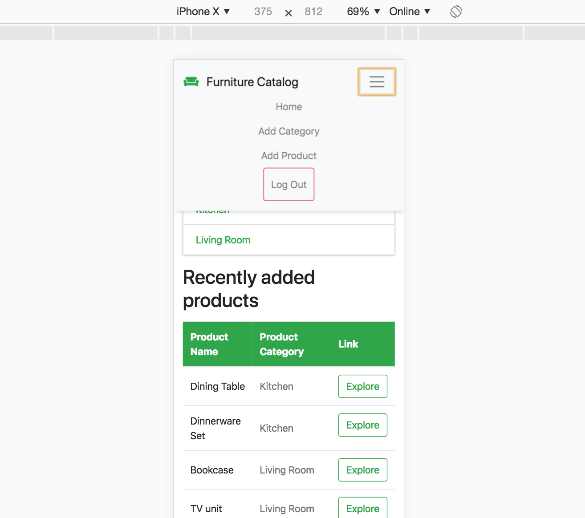

Also, the application returns JSON endpoints for full catalog, categories and products pages.

- Catalog JSON.

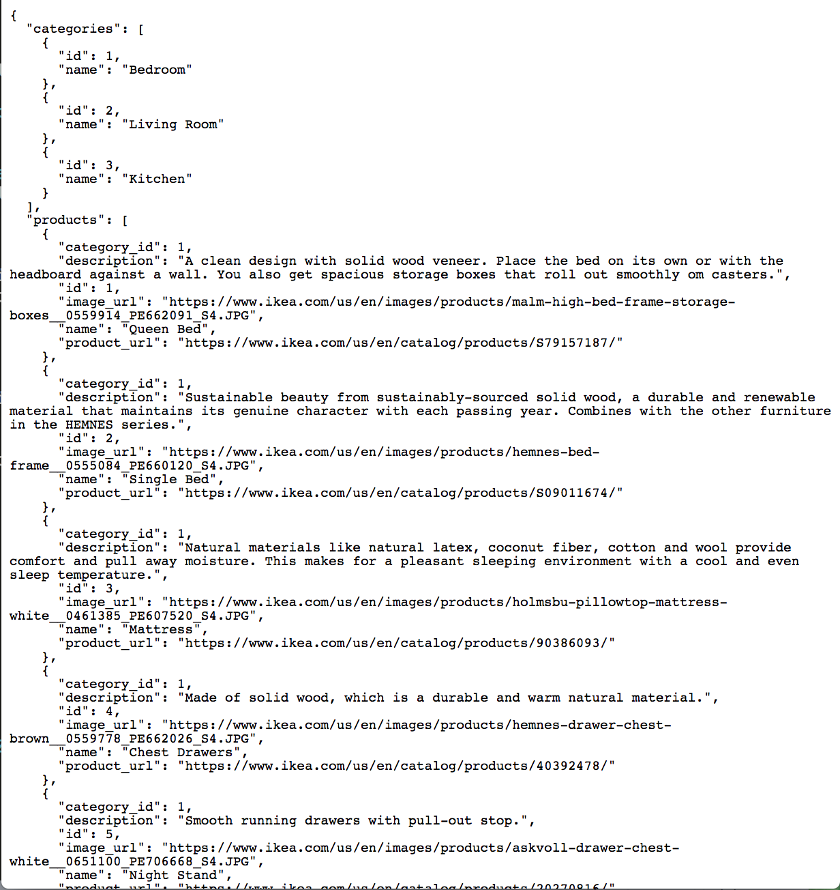

- Categories JSON.

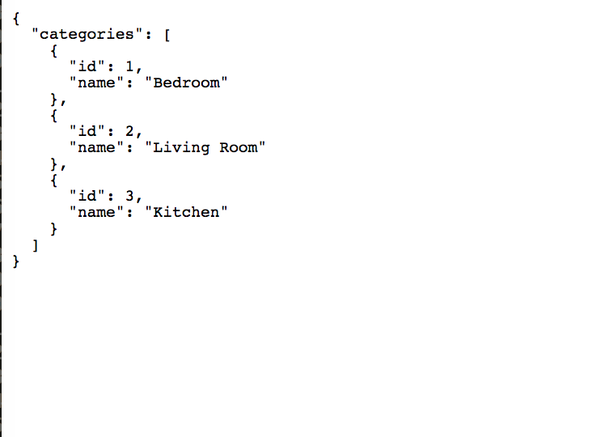

- Products JSON.

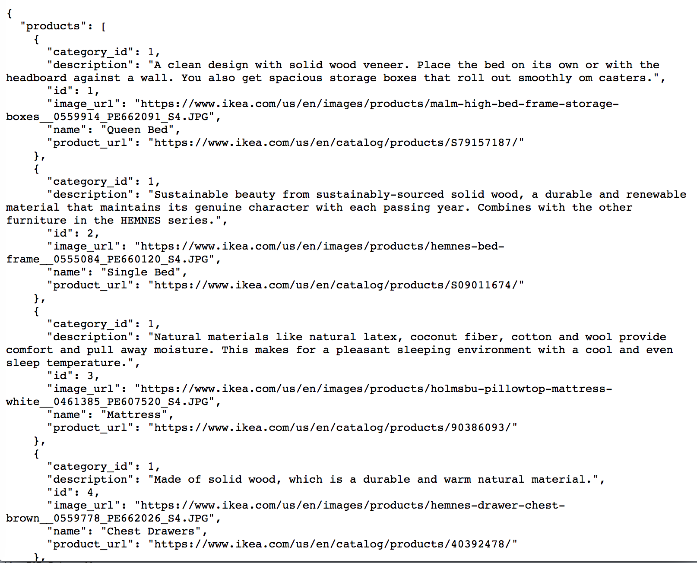

For more description image visit [desc_images](desc_images)

## License

The contents of this repository are covered under the [MIT license](License.md).
